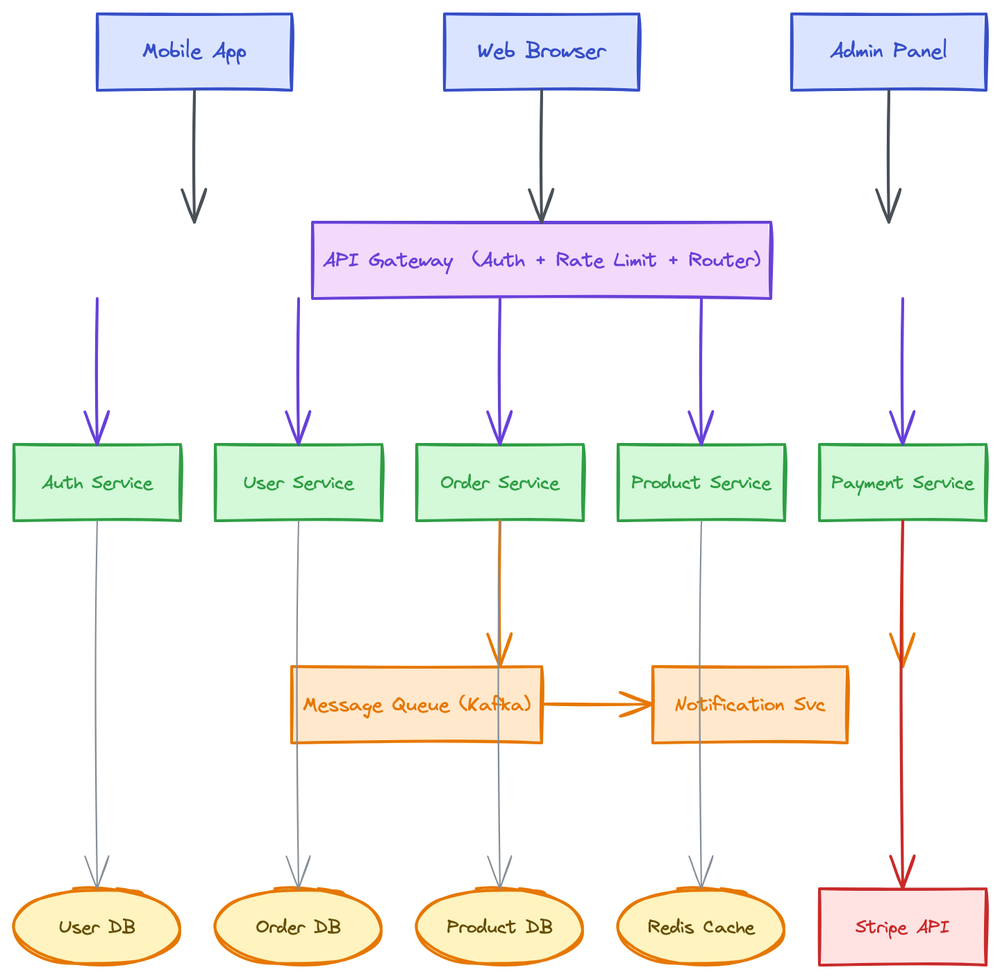

# excalidraw skill

用于在 Claude Code 中生成 Excalidraw 图表并本地导出为 PNG/SVG 的 skill。

[English](README.md)

## 功能说明

- 根据自然语言描述生成 `.excalidraw` JSON 文件
- 使用 `excalidraw-brute-export-cli` 将图表导出为 PNG 或 SVG（基于 Firefox）
- 当图表有助于解释复杂系统时自动触发

## 依赖项

| 工具 | 用途 |
|------|------|
| `excalidraw-brute-export-cli` | 将 `.excalidraw` 导出为 PNG/SVG 的命令行工具 |
| `Playwright + Firefox` | CLI 工具使用的无头浏览器，用于渲染图表 |

## 安装

```bash
npm install -g excalidraw-brute-export-cli
npx playwright install firefox
```

### 平台说明

| 平台 | 额外步骤 |
|------|----------|
| **macOS** | 需要打一次补丁（见下方） |
| **Windows** | 无需额外操作 |
| **Linux** | 无需额外操作 |

### macOS 补丁（一次性，必须）

CLI 使用 `Control+O` / `Control+Shift+E`，但 macOS 需要 `Meta`（Cmd）键：

```bash
CLI_MAIN=$(npm root -g)/excalidraw-brute-export-cli/src/main.js
sed -i '' 's/keyboard.press("Control+O")/keyboard.press("Meta+O")/' "$CLI_MAIN"
sed -i '' 's/keyboard.press("Control+Shift+E")/keyboard.press("Meta+Shift+E")/' "$CLI_MAIN"
```

## 使用方式

直接描述你想要的图表：

```
画一个微服务电商架构图，包含 Mobile/Web/Admin 客户端，API Gateway，
Auth/User/Order/Product/Payment 微服务，Kafka 消息队列，Notification 服务，
以及各自独立的数据库
```

Claude 会自动生成 `.excalidraw` 文件并导出为 PNG。

## 示例

**提示词：**
> 画一个微服务电商架构图，包含 Mobile/Web/Admin 客户端，API Gateway（含认证+限流+路由），
> Auth/User/Order/Product/Payment 微服务，Kafka 消息队列，Notification 服务，
> User DB / Order DB / Product DB / Redis Cache / Stripe API

**输出效果：**



## 文件说明

- `SKILL.md` — Claude Code 加载的 skill 指令文件
- `README.md` — 英文说明
- `README_CN.md` — 本文件（中文）
- `assets/` — 示例图表

## 开源协议

MIT

## 支持作者

如果这个 skill 对你有帮助，欢迎支持作者：

<table>
  <tr>
    <td align="center">
      
      <br>
      <b>微信支付</b>
    </td>
    <td align="center">
      
      <br>
      <b>支付宝</b>
    </td>
    <td align="center">
      
      <br>
      <b>Buy Me a Coffee</b>
    </td>
  </tr>
</table>

## 作者

**Agents365-ai**

- Bilibili: https://space.bilibili.com/441831884
- GitHub: https://github.com/Agents365-ai
